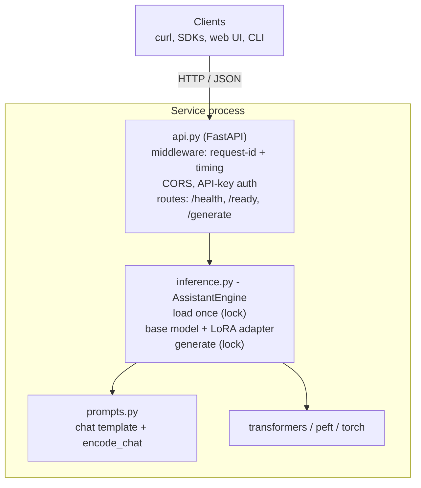
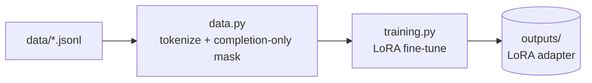
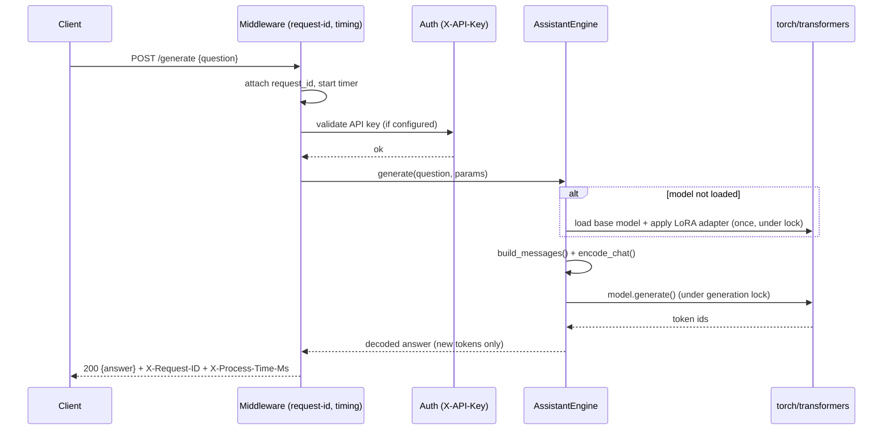
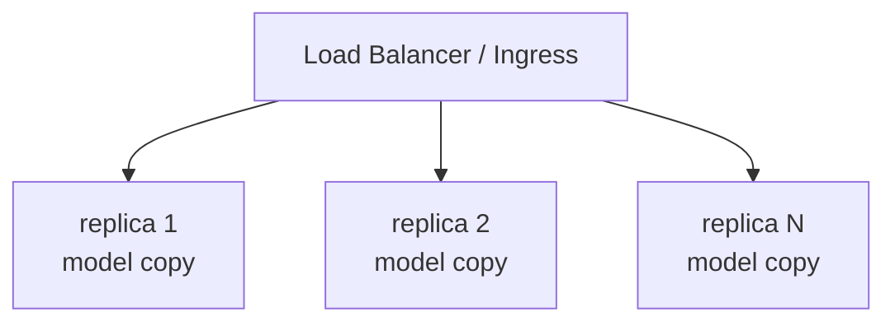

# Architecture (High-Level Design)

This document describes the design of the FastAPI Niche Assistant, a LoRA
fine-tuned TinyLlama model packaged as a standalone inference service. It is
intended to be readable in an HLD review: it states responsibilities, data flow,
the concurrency and scaling model, failure handling, and the trade-offs behind each
decision.

## 1. Goals and non-goals

**Goals**

- Serve a domain-specialized (FastAPI) chat model behind a clean HTTP API.
- Keep training, serving, and the client cleanly separated and independently
  replaceable.
- Be operationally boring: typed config, health/readiness probes, structured logs,
  graceful degradation, and containerization.
- Be reproducible: one command trains the adapter, one command serves it.

**Non-goals**

- Not a general-purpose LLM gateway. It serves a single fine-tuned model.
- Not a distributed training platform. Fine-tuning is a single-node LoRA job.
- High-throughput multi-tenant inference is delegated to a dedicated inference
  server (see section 6, Scaling), not built into this process.

## 2. Component overview

Offline (build time):

Every component has one job:

| Module | Responsibility |
| --- | --- |
| `config.py` | Typed, validated settings from env/`.env` (single source of truth). |
| `logging_config.py` | Human or JSON structured logging with request-scoped fields. |
| `prompts.py` | The shared chat format used by both training and inference. |
| `data.py` | Load JSONL, tokenize with completion-only masking (training only). |
| `training.py` | LoRA fine-tuning; writes the adapter to `outputs/`. |
| `inference.py` | Own the model; load once, generate safely (`AssistantEngine`). |
| `schemas.py` | Pydantic request/response contracts (drive validation + OpenAPI). |
| `api.py` | FastAPI app factory, routes, middleware, auth, health/readiness. |
| `_compat.py` | Cross-version transformers helpers (for example the dtype kwarg). |
| `cli.py` / `__main__.py` | Local REPL and the process entrypoint. |

The prompt format lives in exactly one place (`prompts.py`). This is the most
important invariant in the system: if training and serving disagree on the prompt
format, quality silently collapses. Both call `build_messages()` and
`encode_chat()`.

## 3. Request lifecycle

## 4. Model loading and the adapter bug this design fixes

The fine-tuned artifact on disk is a LoRA adapter, not a full model: it has no
`config.json` or base weights. A naive
`AutoModelForCausalLM.from_pretrained(output_dir)` therefore fails at runtime.
`AssistantEngine` loads the base model first, then applies the adapter with
`peft.PeftModel.from_pretrained`. If no adapter is present it serves the base model
directly (graceful degradation) and logs a warning, so the service still answers
while pointing you at `make train`.

## 5. Concurrency model

- FastAPI runs synchronous path operations in a threadpool, so multiple requests
  can arrive concurrently.
- Model loading is guarded by a lock with a double-checked flag: the weights are
  loaded exactly once even under a thundering herd of first requests.
- Model generation is serialized by a second lock. A single `transformers` model
  instance is not safe to drive from multiple threads simultaneously, and on CPU
  concurrent generation only causes contention. Serializing keeps correctness
  simple and predictable.

The cost of serialization is throughput: one process generates one response at a
time. That is an intentional trade-off, resolved by scaling out (section 6) rather
than by sharing one model across threads.

## 6. Scaling strategy

The service is deliberately stateless (no session state; the only in-memory state
is the read-only model), which makes horizontal scaling straightforward:

1. **Replicate the process** behind a load balancer. Each replica loads its own
   copy of the model; requests are distributed round-robin. This is the primary
   scaling lever and works today with multiple workers or containers.
2. **Offload inference** to a dedicated, batched server (vLLM, TGI, or Triton) when
   throughput/latency demands continuous batching and a paged KV cache.
   `AssistantEngine` becomes a thin client; the HTTP contract is unchanged.
3. **Quantize** (GGUF/GPTQ/AWQ) to shrink memory and increase per-replica density.
4. **Autoscale** on request latency or queue depth; the `/ready` probe gates new
   replicas until their model is loaded.

## 7. Configuration and secrets

All configuration is read once through `pydantic-settings` (`config.py`) and
validated with bounds (ports, token limits, sampling ranges). Secrets such as
`API_KEY` come from the environment or a secrets manager, never from source
control. Filesystem paths (`DATA_DIR`, `OUTPUT_DIR`) are overridable so the same
image runs unchanged across environments.

## 8. Observability

- **Structured logging** (`LOG_JSON=true`) emits one JSON object per log line with
  `request_id`, `method`, `path`, `status_code`, and `duration_ms`, ready for
  ingestion by Loki, the ELK stack, or a cloud logging backend.
- Every response carries `X-Request-ID` (propagated if the client sends one) and
  `X-Process-Time-Ms` for tracing and latency budgets.
- `/health` (liveness) and `/ready` (readiness, which forces a model load)
  integrate directly with Kubernetes probes and load-balancer health checks.

## 9. Failure modes

| Failure | Behavior |
| --- | --- |
| Model files missing or corrupt | `load()` raises `ModelNotReadyError`; `/ready` and `/generate` return 503. Startup does not crash. |
| No fine-tuned adapter | Base model served with a warning; `uses_adapter=false` in responses. |
| Invalid request | Pydantic returns 422 with a precise error location. |
| Missing or invalid API key | 401 before any model work. |
| Generation exception | Logged with request id; client gets a generic 500 (no stack-trace leak). |

## 10. Key design decisions (trade-off log)

- **Native chat template over a bespoke prompt format.** Using
  `tokenizer.apply_chat_template` preserves the base model's instruction-following
  alignment and is what any reviewer expects. Cost: the format is coupled to the
  tokenizer, handled by centralizing it in `prompts.py`.
- **Completion-only loss masking.** Prompt tokens are labeled `-100` so the model
  is trained only to produce the answer. This is the correct objective for
  instruction tuning and materially improves output quality on small datasets.
- **Adapter as a build artifact, not source.** `outputs/` is git-ignored and
  regenerated by `make train`; weights belong in a registry or release, not git.
- **Serialize generation, scale by replication.** Simpler and more predictable than
  sharing one model across threads; the stateless design makes it cheap.
- **App factory (`create_app`).** Enables dependency injection of a fake engine in
  tests, so the full HTTP surface is tested without loading a model or hitting the
  network.
